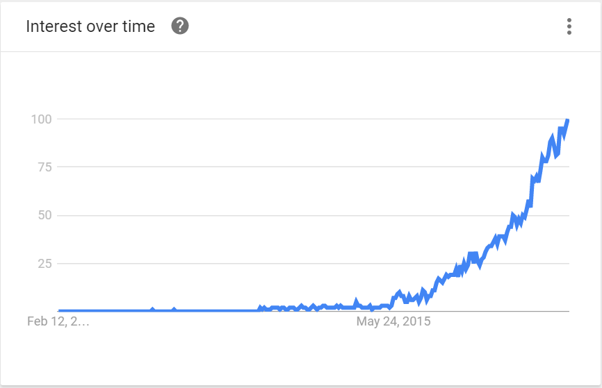

# Why use Vuex, anyway?

Vuex can seem complicated and unfortunately those that explain it jump straight into jargon, or even worse, have terrible analogies that serve as a confusion. This post aims at simplifying it without jargon or fluff for the beginner, but for the advanced user, go into detail about the dos and don'ts of Vuex, and hopefully show you when and where to use Vuex, and why you even want to use it in the first place. Let's get started!

The Vue.js framework, which Vuex is a library for, has been rapidly expanding in popularity since its creation.



I believe this is largely due to its barrier to entry and its simple, concise API. Also, it can be plugged into an existing application with just a few lines of code:

```html
<ul id="app">
  <li v-for="item in todoItems">
    {{ item.title }}
  </li>
</ul>
<script src="//cdnjs.cloudflare.com/ajax/libs/vue/2.2.1/vue.min.js"></script>
```
```javascript
new Vue({
  el: '#app',
  data () {
    return {
      todoItems: [
        {
          title: 'Do laundry',
          isComplete: false  
        }
      ]
    }
  }
})
```

This is pretty much as simple as it gets in the Javascript world. There is not a lot of fat in that markup for a simple Vue.js application. There are no build tools, no webpack, and no JSX. It's certified non-Javascript Fatigue (NJF - trademark pending). I don't believe there is a competitor that has a simpler setup.

So why would we betray this great simplicity and introduce another layer of confusion with Vuex?

Because our apps grow. When you can visually divide elements from a UI into their own separate components, you start to build a tree, where all components are a decendant of just one root component. Each child component has its own data that is represented in its own contained UI. We can visually model an application in this way, and is essentially how HTML is structured. An application's "state" can be seen as the representation of the data (that influences the UI display/behavior) in a javascript object. This is at the core of Vuex. A simple javascript object that represents the state of the application at a given moment in time. Therefore, we can mimic Vuex's state on our own:

```javascript
const state = {
  todoItems: [
    {
      title: 'Do laundry',
      isComplete: false
    }
  ]
}

new Vue({
  computed: {
    todoItems() {
      return state.todoItems
    }
  }
})
```

With this example, we still get the same reactivity and 2-way data binding thanks to the power of Vue. We can use this same object and can use it across multiple components. We now have our own centralized store that automatically reacts to any changes that are made!

[Demo reactive changes with multiple components]

These reactive state changes are magic and freeing. Any component can freely change the state of the application and any other component can react to that change. "But I thought I needed Vuex for that?" you may or may not exclaim. The power of Vuex is not necessarily the centralized nature or in the ability to share state between components, it is in the predictability and maintainability of its state changes. Without state management, what happens when a component unexpectedly changes? What happens when you need to debug an issue? In simple applications, it may seem trivial, but as an application grows, so do the complexity of the problems. And a predictable way for making state changes becomes more necessary.

So when is a good time to use Vuex? This depends on the situation, but a few guidelines to use:

- When you expect to build a large/complex application. If you are just playing around with Vue, there isn't really a reason to use Vuex, but if you expect to undertake a large-scale production SPA, just do it.
- When there are many interactions (state changes) that multiple components need to be aware of. Any highly reactive system can certainly benefit from predictable state changes, which is probably why you are choosing to create an SPA in the first place.
- When you want to enforce structure. Vuex has some nice separation of concerns that helps you keep logic where it is needed.
- Whenever you want to. Just because your app is simple doesn't mean you're forbidden from living your life.

So how does it work, exactly?

Vuex, in its simplest, bare bones version, is just a way of managing a javascript object (or "state management"). Many people are aware of the MVC pattern where you have your View, Controller, and your Model. I like to think of Vuex as something similar to MVC, where you have 3 layers of concern that starts with your View: The view doesn't really care where the data comes from. This is where `actions` come in. A view simply calls actions, which are in charge of orchistrating data, whether it comes from an API, websocket, a file, etc. It knows where the data comes from, and then how to store it (not permanently, just to use in the Vue application). The process of storing the data happens via mutations. An action calls a mutation with an optional payload, and then the mutation is what updates (or mutates) the Vuex state.

[Demo a simple working app with Vuex]

Hopefully you now understand what Vuex is and the motivations for using it. However, even in large-scale applications that are currently using Vuex, there are times when it simply is not necessary to use Vuex's state. After all, components all have their own local state. There are several ways to use/share data, which include:

- Vuex (or any centralized state)
- Props / Events (parent-child communication)
- Local data (data that only one component uses)
- Event bus (global app communication)

I believe each have their own use cases, so let's begin with an example:

```html
<form @submit.prevent="saveName">
  <loader v-if="isSaving"></loader>
  <input type="name" v-model="name">
  <button type="submit">Add</button>
</form>
```

```javascript
new Vue({
  data() {
    return {
      name: null,
      isSaving: false
    }
  },
  methods: {
    saveName() {
      this.isSaving = true

      // Call api, or whatever
      api.saveName(this.name).then(() = {
        this.isSaving = false
      })
      .catch(() => {
        this.isSaving = false
      })
    }
  }
})
```

There are minor details excluded here, but the basic idea is that we want to show a loader when the form is saving. This is a common pattern that is used. When a form is in the middle of saving, it needs to show a loader, an overlay, buttons being disabled, text being displayed, etc (And this pattern of an `isSaving` variable can actually be abstracted in a mixin and tied in with a validator, but that's outside of the scope of this). Only the current component's form cares that it is saving. It is not necessary that `isSaving` is saved in the Vuex state.

But what if a different component does care that this form is in the process of saving, and it is not a child, parent or sibling?

In that case, we can (and perhaps should) save it in the Vuex store. This distinction is very important. The reason is that we can pass data down to children, and pass events up to parents.

[Demo parent-child communication]

Also, the action that the other component cares about matters as well. What if the component only cares about the moment that particular form was saved? Here is an example:

```javascript
const eventBus = new Vue()

new Vue({
  methods: {
    login() {
      eventBus.$emit('loggedIn')
    }
  }
})

new Vue({
  data() {
    return {
      canPlay: false
    }
  },
  created() {
    eventBus.$on('loggedIn', () => {
      this.canPlay = true
    })
  }
})
```

We are using a single empty component to act as an event bus. When the first component emits the `loggedIn` event, any other component can listen on that event by using that same `eventBus` component. In this example, we are able to communicate state changes to multiple components, but we do not need a centralized state to do so.

But can't this be done with Vuex?

Yes, it can. I think there is an important distinction to be made here, though. The first component could have dispatched an action in Vuex which could have fired a mutation that changed state that the second component responded to. HOWEVER, these decisions should be made on a case-by-case basis. What exactly needs to happen when the form is done saving? What component is responsible for what changes? In the above scenario, `canPlay` could easily be represented as Vuex state:

```javascript
const store = {
  state: {
    canPlay: false
  },

  actions: {
    loggedIn({ commit }) {
      commit('SET_CAN_PLAY', true)
    }
  }

  mutations: {
    SET_CAN_PLAY(state, canPlay) {
      state.canPlay = true;
    }
  }
}

new Vue({
  methods: {
    login() {
      this.$store.dispatch('loggedIn')
    }
  }
})

new Vue({
  computed: {
    canPlay() {
      return this.$store.state.canPlay
    }
  }
})
```

Here we can see using Vuex is more verbose, but it still has a few advantages:
- The logic for logging in is centralized in an action. This means that all state management (and other subsequent actions) surrounding logging in will be easy to reason about.
- We have a record of the corresponding mutations.
- Components are free of logic and free of listening to events they probably don't need to care about.

Wait, so you just backtracked on an event bus?

Kind of. The last point about a component being free of logic is important to consider. Are there times when only a component should care about this logic? What owns the data that needs to change? We talked earlier about a component's state (such as `isSaving` on its form), so we know there are scenarios in which a component owns its own data. Even with Vuex modules and a strict organization of Vuex state, state trees can become complex and filled with unnecessary concerns. Imagine seeing `isSaving` all over your state tree, along with display concerns such as `isShow`, `isDisabled`, etc.

All design choices need to be carefully considered, with important questions brought up about ownership of data. So why use Vuex? Why not? Just be sure to fully understand the problem you are trying to solve, and the proper ownership and flow of data.